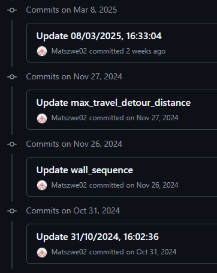

# Git backup for OrcaSlicer

## Features

- during each gcode upload script checks if orca slicer has any new changes
- running as post processing macro
- auto naming commits, so it's really easy to navigate
- easy to roll-back

## Installation

1. clone repo
2. copy its files into `%appdata%\OrcaSlicer`
3. create repository OrcaSlicer at this path
4. add files as per .gitignore
5. put `start.bat` into your post processing script
6. ensure `start.bat` executes backup (check `git.log` file)

## Deps

- python 3 in PATH
- windows (for linux paths need to be changed)
- logged in to git